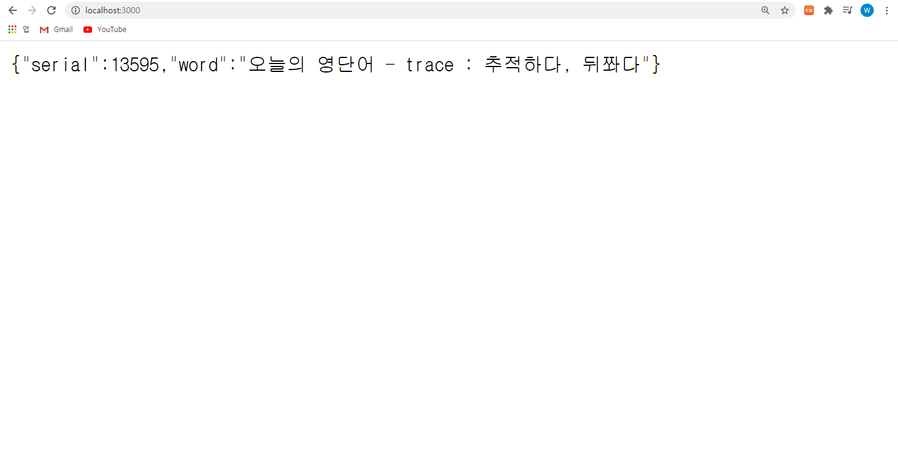

# 명언 API  

쉽고 간단하게 명언을 확인해보세요!    
현재 등록된 명언은 약 16000개입니다.   

추가하고 싶으신 명언이 있으시면 `ISSUE` 를 통해 알려주세요.    

# Node.js 사용 예시

```js
const fetch = require('node-fetch');
const url = '도메인 추가 예정';

fetch(url).then(res => res.json()).then(json => {
  console.log(json) 
})

// 반한값 : {"serial":4365,"word":"결혼은 그것이 최대 유혹과 최대 기회의 결합이기 때문에 인기가 있다. -버나드 쇼 "}
```

# 반환 정보
| 이름     | 타입   |
|---------|--------|
| `serial`| Number |
| `word`  | String |    


***기여는 환영합니다! 언제든지 ISSUE & PR 해주세요!***